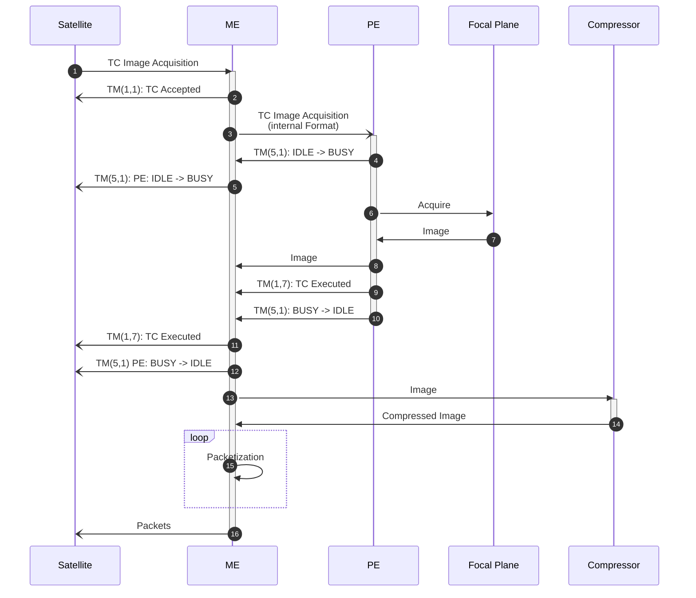

# State machine

## TC Image Acquisition

```mermaid
sequenceDiagram
    autonumber
    participant S as Satellite
    S ->> ME: TC Image Acquisition
    activate ME
    ME-)S: TM(1,1): TC Accepted
    ME-)PE:TC Image Acquisition<br/>(internal Format)
    activate PE
    PE->>ME:TM(5,1): IDLE -> BUSY
    ME-)S:TM(5,1): PE: IDLE -> BUSY
    participant F as Focal Plane
    PE ->> F: Acquire
    F->>PE:Image
    PE->>ME:Image
    PE->>ME:TM(1,7): TC Executed
    PE->>ME:TM(5,1): BUSY -> IDLE
    deactivate PE
    ME-)S:TM(1,7): TC Executed
    
    ME-)S: TM(5,1) PE: BUSY -> IDLE
    participant C as Compressor
    ME->>C: Image
    activate C
    C->>ME: Compressed Image
    deactivate C
    loop 
        ME->>ME:Packetization
    end
    ME-)S:Packets
    deactivate ME

```